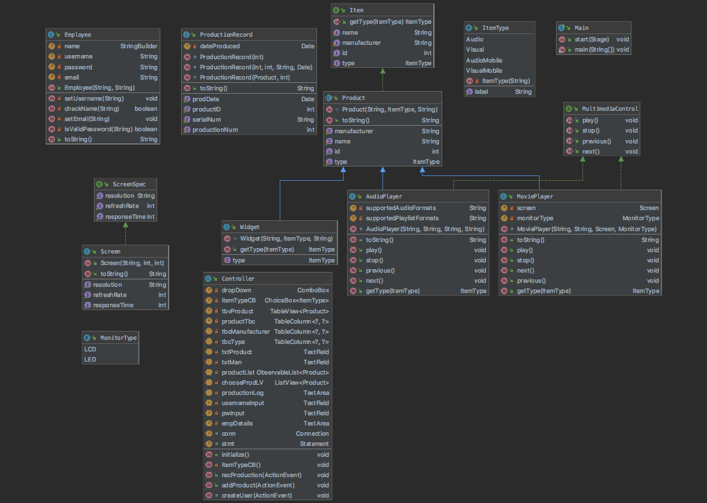
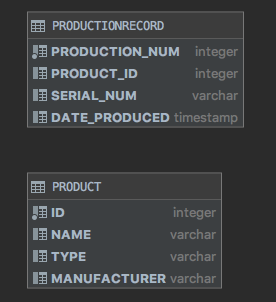

# ProductLine OOP

This project is an assigment for COP 3003 (Object-Oriented Programming) course at Florida Gulf Coast University. This project was started in August, 2019 and finsihed December 13, 2019.  
The program provides a UI to allow user to create products store them in a DB and generate a production log. It also provides the user with an Employee tab so they are able to login as well as create an account. 

## Demonstration

*comming soon*

## Documentation

[JavaDoc](https://carolinabado17.github.io/ProductLineOOP/)

## Diagrams
Class Diagram
 
  
 Database Diagram 
 
 

## Getting Started

*jar file coming soon*  
* Windows: 
  * Extract the <PROJECT FOLDER NAME> folder to C:\Users\**YOUR USERNAME**\IdeaProjects 
* Mac: 
  * Extract the <PROJECT FOLDER NAME> folder to Directory: /Users/**YOUR USERNAME**/EventFinder  
* IDE 
  * File > New > Project From version control > Enter URL/HTTP > Choose the directory for project > clone 
  
## Built With

* IntelliJ IDE  
* JavaFX  
* SceneBuilder (for GUI)   
* Database --> H2 and SQL  

## Contributing

* Increase Security   
* Enhancements on Human User Factors (wrong inputs, not all fields are filled, etc)   

## Author

* Carolina Bado-Cortes

## License

https://github.com/carolinabado17/ProductLineOOP/blob/master/LICENSE

## Acknowledgments

* Professor Scott Vanselow  
* class mates: Louis Sze, José Rivera 
* GeeksforGeeks (https://www.geeksforgeeks.org/javafx-alert-with-examples/) 
* Regular expressions.info (https://www.regular-expressions.info/tutorial.html)  
* To populate database (https://www.youtube.com/watch?v=LoiQVoNil9Q) 

## History
 * this information was taken from Prof. Vanselow's website *  
Sprint 1 (ALPHA)  
WEEK 1  
* Created JavaFX project.  
* Shared to private repo on GitHub.  
* Created README.  

WEEK 2 
* Added a tab view with 3 tabs : Product Line, Produce, and Production Log  
* Added a CSS file with some code.  

WEEK 3  
* In Product Line tab:  
  * In the Anchor Pane 
    * Added a 2x3 GridPane  
      * Added label and text field for Product Name 
      * Added label and text field for Manufacturer 
      * Added label and choiceBox for ItemType 
    * Added button - Add Product  
      * Added event handler to the button click event. 
    * Added label and a table View for Existing Products  
  * Produce Tab - in the AnchorPane 
    * added a label and listView for Choose Product.  
    * added label and comboBox for Choose Quantity.  
    * Created button - Record Production  
  * Production Log Tab - added text area  
  
WEEK 4 
* installed db software, created db in res folder  
* connected to DB  

WEEK 5  
* In the Product Line tab, for the Add Product button event handler, add code to insert a product into the database  
* Built a sql statement to get the values from UI  
* Populated the combobox (in ProduceTab) with values 1-10  

Sprint 2 (BETA) 
WEEK 6 
* created a enum (itemType)  
* filled the choiceBox with the types from the Enum.  
* Interface called Item with methods  
* created an abstract type called Product 
  * holds int id, string type, string manufacturer, and string name  
* created a constructor to take the the objects from the abstract class.  
* created a toString() method 

WEEK 7  
* created an interface called Multimedia Controll with 4 methods  
* Audio Player class that is a subclass of Product and implements Multimedia Control  
  * constructor to take 4 parameters 
  * it calls the parent's constructor and sets up the mediatype to AUDIO  
* created anothe toString() method.  

WEEK 8  
* created enum Monitor Type with 2 types (LCD and LED)  
* ScreenSpec interface that defines 3 methods  
* Screen class implements ScreenSpec  
  * added 3 fields (String resolution, int refreshrate, int responsetime) 
* MoviePlayer class that extends to Product and implements MultimediaControl 
  * sets up the item type to VISUAL  

WEEK 9  
* created a ProductionRecord concrete class (gets auto-incremented by the db)  
* added getters and setter for all fields  
* created constructor that has a parameter productID, this will be called when the user records production from the user interface 
* display the production record in textArea in Production Log tab  

WEEK 10  
* generate a unique serial number  
  * serial number should start with first 3 letters of the man, then 2 letters from the ItemType code, then 5 digits (with leading 0's) 

WEEK 11  
* show all products in the product line tab tableView  
* created observable list (productList) to hold all products that can be produced. 
* set the items of the TableView to the observableList  
* show all products in the produce tab listView 
* show the production log in the production log tab TextArea 

Sprint 3 (RELEASE) 
WEEK 12  
* check that h2 dirver jar file was copied to my res folder 
* Controller initialize method does the following when the program starts: 
  * define the ObservableList  
  * call setupProductLineTable  
  * associate the ObservableList with the Product Line ListView  
  * call loadProductList  
  * call loadProductionLog  
* add product button does the following:  
  * insert added product into database  
  * call loadProductList  
* loadProductList does the following:  
  * create Product objects from the Product DB table and adds them to the productList ObservableList  
* Record Production button does the following:   
  * Gets the selected product from the Product Line ListView and the quantity from the comboBox.  
  * Creates an ArrayList of ProductionRecord objects named productionRun.  
  * Send the productionRun to an addToProductionDB method.  
  * call loadProductionLog 
  * call showProduction 
* showProduction does:  
  * populates the TextArea on the Production Log tab with the information from the productionLog, replacing the productId with the product name, with one line for each product produced  
* addToProductionDB method does the following: 
  * Loop through the productionRun, inserting productionRecord object information into the           ProductionRecord database table. 
* loadProductionLog method does: 
  * Create ProductionRecord objects from the records in the ProductionRecord database table.  
  * Populate the productionLog ArrayList 
  * call showProduction 

WEEK 13  
* set the db password and read the password from a file  
* created 4 fields for the class (name, username, password, email)  
* methods: 
  * private void setUsername 
  * private boolean checkName 
  * private void setEmail 
  * private boolean isValidPassword 
* constructor will checkName (if the name contains a space. If it does, it will call setUsername and setEmail, passing the name in to both. If it doesn't contain a space, set the username to "default" and the email to "user@oracleacademy.Test")  
* setUsername will set the username field to the first initial of the first name and then the last name, all lowercase.  
* setEmail will set the email field to the first name, then a period, then the last name (all lowercase) followed by @oracleacademy.Test 

## Key Programming Concepts Utilized

enums - Java type used to define collections of constants (may contain constants as well as methods)  
interface - tells a class what to do but DOES NOT do it. (blueprint for class) 
abstract - used as a base to extend or implement classes. Used to 'hide' uneccessary info and displaying only essential information to the user.  
inheritance - mechanism in OOP where an object can accquire all of the properties of a parent class.  
polymorphism - 'many forms' we can perform a method in many different ways by using overriding and overloading  
encapsulation - wrapping data and the code into a single unit.  
lambda expressions - fucntion that can be created wihtout having to belong to any class also allows to express instances of single method classes 
recursion - when a method calls itself 
implement - key word for interfaces when they are implemented by another class.  
extending - you are creating a subclass of the base class you are extending (key word) 

